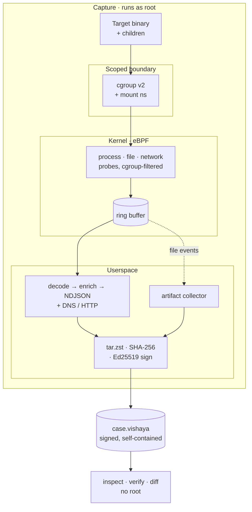

<div align="center">

# Vishaya

**A verifiable, target-scoped forensic evidence bundle for a single suspect Linux binary.**


Run one suspect binary inside a scoped boundary, record everything it does — and every process it spawns — at the kernel level, and get a **single signed file** anyone can open, **cryptographically verify**, and inspect years later, on any machine. No agent, no database, no cloud.

[**Get started**](docs/getting-started.md) · [**Bundle spec**](docs/bundle-spec-v0.1.md) · [**Roadmap**](docs/roadmap.md) · [**All docs**](docs/index.md)

<sub>*विषय (Sanskrit) — “the subject-matter of investigation.”*</sub>

</div>

---

## See it

```bash
# Capture — one command, one file (root required)
sudo vishaya capture --target /bin/sh --output case.vishaya -- -c 'curl http://example.com'

# Inspect — anywhere, later, no root, no daemon
vishaya summary  case.vishaya      # one-screen verdict — start here
vishaya tree     case.vishaya
vishaya timeline case.vishaya
```

```text
$ vishaya tree case.vishaya
bundle: case.vishaya
target: pid=48213 exec=/bin/sh cmdline="sh -c curl http://example.com"

└── sh (pid=48213 exec=/bin/sh)
    └── curl (pid=48219 exec=/usr/bin/curl exit=0)
```

```text
$ vishaya timeline case.vishaya

TIME (UTC)                  PID     COMM     EVENT                 DETAIL
------------------------------------------------------------------------------------
2026-07-21T09:14:02.104Z    48213   sh       process:exec          /bin/sh (sh -c curl http://example.com)
2026-07-21T09:14:02.140Z    48219   curl     process:exec          /usr/bin/curl (curl http://example.com)
2026-07-21T09:14:02.151Z    48219   curl     network:dns-query     127.0.0.53:53 A example.com
2026-07-21T09:14:02.167Z    48219   curl     network:dns-answer    127.0.0.53:53 A example.com
2026-07-21T09:14:02.170Z    48219   curl     network:http-request  93.184.216.34:80 GET example.com/
2026-07-21T09:14:02.205Z    48219   curl     process:exit          code=0
```

> **The bundle is just `tar.zst` + JSON** — you don't even need Vishaya to read one:
> ```bash
> zstd -dc case.vishaya | tar -xO events.ndjson | jq
> ```

---

## Try it in 2 minutes — no build, no root

The repo ships real sample captures in [`samples/`](samples/). Inspection and verification need neither root nor a build — only `capture` does.

```bash
vishaya summary  samples/04-http-curl.vishaya        # one-screen verdict
vishaya network  samples/04-http-curl.vishaya        # decoded DNS + HTTP
vishaya verify   samples/04-http-curl.vishaya        # integrity + signature verdict
```

No CLI yet? A bundle is an open format — read it with tools you already have:

```bash
zstd -dc samples/04-http-curl.vishaya | tar -xO events.ndjson | jq
```

---

## How it works



A target runs inside a kernel-enforced cgroup scope; eBPF records its process/file/network activity (filtered to that cgroup); userspace decodes it, optionally snapshots the files it dropped, and writes one **signed** `.vishaya`. Anyone can later open it, verify it, and inspect it — no root, no daemon. Full detail in [architecture.md](docs/architecture.md).

---

## Why Vishaya

Plenty of tools trace Linux processes, and a portable capture format already exists (Sysdig/CNCF's `.scap`, viewable in Stratoshark). Vishaya's edge isn't "a capture format" — it's the **combination none of them offer**:

| | |
|---|---|
| **Verifiable evidence, not just telemetry** | Every bundle is SHA-256 integrity-hashed and Ed25519-signed; the reader checks both at open time. `.scap`, Tracee `--capture`, and CAPE output are all unsigned. *(Self-generated key today = tamper-evidence + pinned-key verification; third-party attestation is the v1.0 Sigstore milestone.)* |
| **Target-scoped, not host- or fleet-wide** | Falco, Tetragon, Tracee, even `.scap` watch the whole host. Vishaya observes exactly one target and its descendants, filtered in-kernel by cgroup — a capture is a *case*, not a firehose. |
| **One self-contained file** | Not a database, not a SIEM stream, not a tool-specific directory tree. One `.vishaya` you hand to a colleague, archive, and re-open years later. |
| **An open, documented format** | `.vishaya` is a spec, and a bundle is plain `tar.zst` + NDJSON + JSON. A 20-line script can read one. |
| **Robust by format** | A flat, append-only NDJSON event log — no deeply nested document to overflow or silently truncate. |
| **CLI-first. No daemon, no cloud** | Install a binary, run it, get a file. Nothing phones home. |

> Vishaya is a **recorder** — not an EDR, a SIEM, or a fleet monitor, and it doesn't try to be.

---

## What's in a capture

A `.vishaya` file is a `tar.zst` archive:

| Entry | Contents |
|---|---|
| `manifest.json` | Schema/tool version, host kernel & arch, target path + SHA-256, isolation info, event counts, integrity hashes, and the Ed25519 signature |
| `events.ndjson` | One JSON event per line — process (exec/fork/exit/clone), file (openat/unlinkat/renameat2), network (socket lifecycle + decoded DNS + plaintext HTTP), optional raw syscalls |
| `process_tree.json` | Reconstructed process lineage rooted at the target |
| `artifacts/` + `artifacts.json` | Files the target created/modified, copied in with `--capture-artifacts` — content-addressed (`artifacts/<sha256>`), hashed, and indexed. Empty without the flag. |

Process events carry the executed path and full command line, resolved in-kernel at exec time. Network payloads are decoded in userspace into `dns-query`/`dns-answer` and `http-request`/`http-response`. Timestamps map to wall-clock via a manifest clock anchor. Full schema: the [**bundle spec**](docs/bundle-spec-v0.1.md).

---

## Install & build

Linux only, by design — kernel **5.15+** with eBPF + CO-RE, cgroup v2, and `/sys/kernel/btf/vmlinux`. Root is required for `capture`; inspection needs no privileges.

```bash
./scripts/linux.sh check    # host preflight + package-install hints for your distro
./scripts/linux.sh all      # build userspace + BPF object
```

<details>
<summary><b>Dependencies</b></summary>

clang/LLVM, bpftool, libbpf (BPF build); CMake ≥ 3.20, a C++20 compiler, libzstd, libarchive, nlohmann-json ≥ 3.9, CLI11 ≥ 2.2, OpenSSL ≥ 1.1.1 (userspace). `./scripts/linux.sh check` prints exact package names for Debian/Ubuntu, Fedora, and Arch. Full walkthrough: [getting-started.md](docs/getting-started.md).
</details>

The build produces `build/vishaya` (the CLI) plus `build/isolation_probe` and `build/bundle_probe` (standalone smoke tests).

---

## Usage

```bash
# Capture a target's activity (root). Add --capture-artifacts to also bundle dropped files.
sudo ./build/vishaya capture --target /usr/bin/curl --capture-artifacts \
    --output /tmp/curl.vishaya -- https://example.com

# Inspect (no root)
./build/vishaya summary   /tmp/curl.vishaya    # one-screen verdict — start here
./build/vishaya tree      /tmp/curl.vishaya
./build/vishaya files     /tmp/curl.vishaya
./build/vishaya network   /tmp/curl.vishaya
./build/vishaya timeline  /tmp/curl.vishaya
./build/vishaya artifacts /tmp/curl.vishaya    # files captured with --capture-artifacts

# Compare two runs of the same sample — what changed? (exit 0 = identical, 1 = differs)
./build/vishaya diff   run-a.vishaya run-b.vishaya

# Verify integrity + signature + artifacts (no root); optionally pin the signing key
./build/vishaya verify /tmp/curl.vishaya
./build/vishaya verify /tmp/curl.vishaya --verify-key <base64-ed25519-pubkey>
```

Add `--enable-syscalls` to a capture for raw syscall events (high volume; off by default).

---

## Status


<table>
<tr><th align="left">Shipped</th><th align="left">Next (v0.5 → v1.0)</th></tr>
<tr valign="top"><td>

- Target-scoped capture (cgroup v2 + mount ns)
- Process · file · network events
- DNS + plaintext-HTTP decoding
- Ed25519-signed bundles, verified at open time
- Pinned-key verification (`--verify-key`)
- Artifact capture (dropped files, content-addressed)
- 8 inspect commands: `summary` `tree` `files` `network` `timeline` `verify` `diff` `artifacts`

</td><td>

- HTTPS plaintext via TLS-library uprobes
- STIX 2.x export
- Packaging — deb/rpm, static binary
- Reader SDK (Python)
- **v1.0:** Sigstore/Rekor attestation + frozen schema

</td></tr>
</table>

See the full [**roadmap**](docs/roadmap.md) for details and what's deliberately out of scope.

---

## Scope

**Vishaya is the flight recorder, not the aircraft** — it produces the evidence; it does not provide the containment. The cgroup + mount-namespace scope prevents *accidental* host contamination; it is **not** a hardened detonation chamber, and a determined, root-adjacent sample can escape it. For genuinely adversarial malware, run Vishaya **inside a VM/hypervisor sandbox** (a full VM, DRAKVUF, a Cuckoo/CAPE guest) — that's the chamber; Vishaya is the black box inside it.

The default signature uses a locally generated key: strong **tamper-evidence + pinned-key verification**, not third-party attestation.

<details>
<summary><b>Non-goals</b></summary>

- Not an EDR, SIEM, or fleet monitor — no runtime alerting, blocking, or policy enforcement
- No Windows or macOS — Linux only
- No cloud service, telemetry, or phone-home
- No kernel module — eBPF only
</details>

---

## Documentation

Everything lives in **[docs/](docs/index.md)**. Good entry points:

- [**getting-started.md**](docs/getting-started.md) — install, build, first capture, first inspect
- [**vision.md**](docs/vision.md) — what Vishaya is, and the deliberate non-goals
- [**bundle-spec-v0.1.md**](docs/bundle-spec-v0.1.md) — the `.vishaya` format, for anyone building a reader
- [**roadmap.md**](docs/roadmap.md) — what's shipped, what's next, what's out of scope
