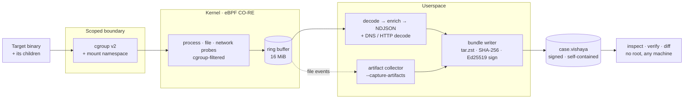
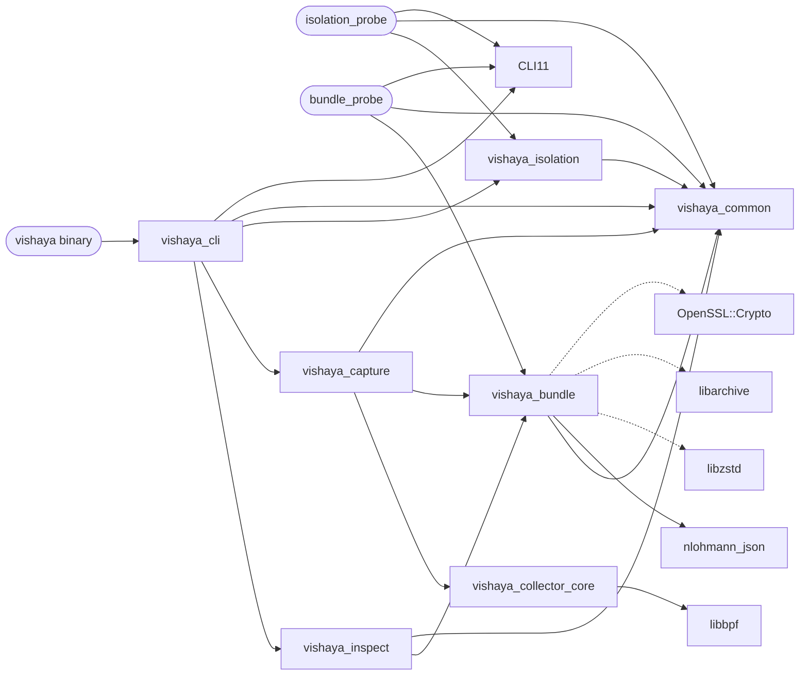
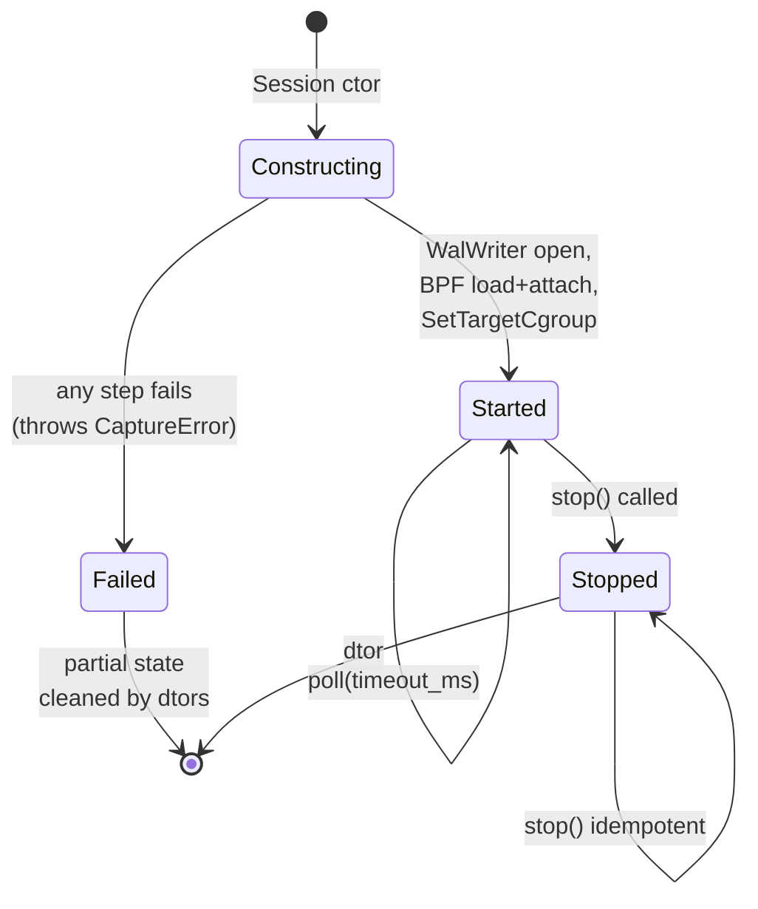

# Vishaya — Architecture

> *Optional. For contributors and reviewers of the code — not needed to install, run, or read a
> bundle. Just want to use it? See [getting-started.md](getting-started.md).*

The design reference for Vishaya (bundle schema 0.2.0). It explains how a capture flows from
a target binary to a signed, verifiable `.vishaya` file, and why the pieces are shaped the way
they are.

Companion docs:
- [vision.md](./vision.md) — product scope and principles
- [flow.md](./flow.md) — sequence diagrams for capture and inspect paths
- [concepts.md](./concepts.md) — background primer (eBPF, cgroups, namespaces, DFIR)
- [bundle-spec-v0.1.md](./bundle-spec-v0.1.md) — bundle format specification

---

## 1. Scope

Vishaya is a Linux-only, eBPF-native forensic capture tool that:

1. Launches a target binary inside a scoped isolation boundary (namespaces + cgroup)
2. Captures the target and its descendants via eBPF probes (process, file, network events)
3. Optionally copies the files the target created/modified into the bundle (`--capture-artifacts`)
4. Writes everything to a single portable, signed `.vishaya` bundle file
5. Provides a CLI to inspect and verify any `.vishaya` bundle offline

Shipped since the initial design: artifact capture and semantic `diff` (both in v0.2), and
Ed25519 signing/verification. Still deferred (and not shaping the architecture beyond staying
additive): HTTPS plaintext via TLS uprobes and LLM/MCP integration. SCAP interop was evaluated
and **dropped** — see [roadmap.md](./roadmap.md).

---

## 2. System overview

End to end: a target runs inside a kernel-enforced scope, eBPF records what it does, and the
userspace pipeline packages it into one signed file that anyone can later verify and inspect.



The kernel and userspace sides share one C ABI, `include/event_schema.h` (struct layouts the
BPF probes write and the decoder reads). For step-by-step sequence diagrams of the capture and
inspect flows, see [flow.md](./flow.md).

---

## 3. High-level runtime picture

### Capture path

```
User ─── vishaya capture --target ./sample.elf --output case.vishaya ──┐
                                                                        ▼
                                                              ┌───────────────┐
                                                              │ cli/          │
                                                              │ dispatch      │
                                                              └───────┬───────┘
                                                                      ▼
                                             ┌────────────────────────────────────┐
                                             │ capture/                           │
                                             │  1. isolation setup (ns + cgroup)  │
                                             │  2. BPF load + attach              │
                                             │  3. fork+exec target into cgroup   │
                                             │  4. ring buffer poll               │
                                             │  5. decode → enrich → WAL write    │
                                             └───────────────────┬────────────────┘
                                                                 ▼
                                                     /tmp/vishaya-<uuid>/
                                                     ├── events.ndjson
                                                     └── artifacts/   (--capture-artifacts)

                                                      (target exits or Ctrl-C)
                                                                 ▼
                                             ┌────────────────────────────────────┐
                                             │ bundle/writer                      │
                                             │  1. reconstruct process tree       │
                                             │  2. snapshot artifacts (if enabled)│
                                             │  3. SHA-256 events/tree/artifacts  │
                                             │  4. sign manifest (Ed25519)        │
                                             │  5. tar+zst → case.vishaya.tmp     │
                                             │  6. fsync + rename → case.vishaya  │
                                             │  7. teardown isolation, cleanup    │
                                             └───────────────────┬────────────────┘
                                                                 ▼
                                                            case.vishaya
```

### Inspect path

```
User ─── vishaya tree case.vishaya ──┐
                                      ▼
                             ┌───────────────┐
                             │ cli/          │
                             └───────┬───────┘
                                     ▼
                          ┌────────────────────┐
                          │ bundle/reader      │
                          │  1. validate schema│
                          │  2. parse manifest │
                          │  3. stream events  │
                          └──────┬─────────────┘
                                 ▼
                          ┌───────────────┐
                          │ inspect/tree  │  (or summary/files/network/timeline/verify/diff/artifacts)
                          └───────┬───────┘
                                  ▼
                             stdout view
```

Capture requires root (eBPF + namespaces). Inspect requires no privileges — just read the file.

---

## 4. Module layout

Current module layout:

```
bpf/                            (kernel-side probes)
  vishaya.bpf.c                 (aggregator; #includes the four probe files)
  vishaya_common.bpf.h          (maps, helpers, cgroup filter, payload capture)
  vishaya_process.bpf.c
  vishaya_file.bpf.c
  vishaya_network.bpf.c
  vishaya_syscall.bpf.c

include/
  event_schema.h                (shared C ABI between BPF and userspace)

src/
  common/                       (log, errors, TmpDir RAII helper)
  collector/                    (inherited BPF load/attach/poll — namespace vishaya::collector)
  decoder/                      (raw bytes → EventVariant — namespace vishaya::collector)
  enricher/                     (/proc enrichment for process events — namespace vishaya::collector)
  isolation/                    (Cgroup + target_launch)
  bundle/                       (writer + reader + manifest + artifacts + process_tree + hash + sign + schema_version)
  capture/                      (Session + WalWriter + event_to_json + protocol_decoder + artifact_collector)
  inspect/                      (summary/tree/files/network/timeline/verify/diff/artifacts subcommands)
  cli/                          (dispatcher + capture_cmd + main)

scripts/
  linux.sh                      (build + host check)
```

### Library dependency graph



Solid arrows = PUBLIC link (headers exposed transitively). Dashed = PRIVATE (implementation dep only).

**Cross-module dependency direction is strictly one-way** (top-down in the graph above). No cycles. The rule: `cli/` may depend on anything below it; `capture/` and `inspect/` never depend on each other; both depend on `bundle/`; `bundle/` and `isolation/` are peers; everything depends on `common/`.

### Session state machine

The `vishaya::capture::Session` lifetime dictates when BPF probes are alive:



The critical invariant: `started_ = true` is set *immediately* after `Collector::Start()` succeeds, before any subsequent constructor code that could throw. This guarantees the destructor will properly detach BPF probes even on partial-construction failures.

---

## 4b. Bundle format

Single file: `case.vishaya`. Container: `tar.zst`. Contents:

```
case.vishaya  (tar.zst)
├── manifest.json
├── events.ndjson
├── process_tree.json
├── artifacts/                (empty unless --capture-artifacts)
│   └── <sha256>              (content-addressed captured files)
└── artifacts.json            (artifact index; present only with --capture-artifacts)
```

`artifacts/` is empty and `artifacts.json` absent for a capture run without
`--capture-artifacts` — byte-compatible with pre-artifact (0.1) bundles.

### manifest.json

Top-level sections: `schema_version`, `tool`, `capture` (times + duration + a
CLOCK_MONOTONIC↔CLOCK_REALTIME clock anchor + `host`), `target` (path, sha256, args,
env_count), `isolation`, `coverage` (families + network_layers + syscalls_captured +
artifacts_captured), `counts` (incl. artifacts_count), `integrity` (SHA-256 of events,
process_tree, and — when present — artifacts.json), and `sig` (the Ed25519 signature block:
`algorithm`, `scope`, `pubkey_b64`, `sig_b64`).

The **authoritative, complete, field-by-field schema lives in
[bundle-spec-v0.1.md §3](bundle-spec-v0.1.md)** — kept there as the single source of truth so
it can't drift from a duplicated example here.

### events.ndjson

One event per line, JSON-serialized from the existing C event schema (`include/event_schema.h`). Reuses the existing sink's serialization work as much as possible.

### process_tree.json

A `root_pid` plus a `processes[]` array — one record per real process (thread-group leader),
each with pid/tgid/ppid/comm/exec_path/cmdline/cwd/uid/gid, `start_ts_ns`, nullable
`end_ts_ns`/`exit_code`, and `children` (child TGIDs). Full field list and semantics:
[bundle-spec-v0.1.md §5](bundle-spec-v0.1.md) (single source of truth).

### Schema versioning rules

- `manifest.schema_version` follows semver.
- Reader rejects **bundle major > reader major** with a clear error.
- Reader accepts **bundle major ≤ reader major**; ignores fields it doesn't recognize.
- v0.x is **additive-only** (existing fields never removed/renamed/retyped — safe to build a reader against today); v1.0.0 will be the first frozen major. See the spec's stability commitment.

---

## 5. Event family coverage

| Family | Enabled by default | Notes |
|---|---|---|
| **Process** | Yes | exec, fork, exit, clone, clone3, vfork |
| **File** | Yes | openat, unlinkat, renameat2 (existing set) |
| **Network — socket lifecycle** | Yes | socket, connect, accept, bind, listen, close, sendto, recvfrom, sendmsg, recvmsg, read/write on sockets, shutdown (existing) |
| **Network — DNS** | Yes | Parse UDP:53 payload in userspace decoder. Requires small payload capture (first N bytes) on UDP sends/recvs. Emits `dns-query` / `dns-answer` events with question, type, resolved IPs. |
| **Network — HTTP plaintext** | Yes | Parse first N bytes of TCP send/recv looking for HTTP/1.x method line and Host header. Emits `http-request` / `http-response` events with method, path, host, status. |
| **Network — HTTPS plaintext** | **DEFERRED to v0.5+** | Requires TLS-library uprobes (OpenSSL / BoringSSL / GnuTLS / NSS / Go crypto/tls). HTTPS *connections* still captured at socket level (endpoints, byte counts). |
| **Syscall** | No (opt-in via `--enable-syscalls`) | Existing raw sys_enter / sys_exit capture. High volume, low semantic value for default DFIR use. |

---

## 6. Isolation model

Target runs inside a fresh cgroup and a mount namespace:

- **Cgroup v2** — the scoping mechanism. Target is placed in a fresh cgroup at capture start; all eBPF probes filter events by cgroup ID via `bpf_get_current_cgroup_id()` and drop events from any other cgroup. Children inherit the cgroup automatically → correctness is kernel-managed.
- **Mount namespace** — target has an isolated view of the filesystem. `MS_REC | MS_PRIVATE` on `/` prevents mount changes from propagating back to the host.
- **PID namespace** — deliberately NOT used. Would require a double-fork trick (unshare + fork so the target becomes PID 1) that adds complexity without buying scoping — cgroup filter already handles that. Deferred to v0.5 if needed for container-like semantics.
- **Network namespace** — deliberately NOT used. Isolating the target's network without a veth pair means the target has no network at all (just loopback), which severely limits realistic malware analysis. Full net-ns + veth setup is deferred to v0.5.
- **User namespace** — deliberately NOT used (see D3 below).

The critical scoping invariant is cgroup-based, not namespace-based. Namespaces are for *isolation* (protecting host, controlling what target sees). Scoping (capturing only target activity) is 100% cgroup-driven.

---

## 7. Design decisions (locked)

### D1. Single binary with subcommands
`vishaya capture`, plus offline readers `vishaya summary`, `tree`, `files`, `network`, `timeline`, `verify`, `diff`, and `artifacts`. Mental model: `git`, `docker`, `kubectl`. One artifact to install, one thing to explain.

### D2. Target scoping via cgroups v2 (not PID tracking)
Cgroup ID filtering, not a "watched PID" BPF map — children inherit the cgroup, so scoping is kernel-managed. Full rationale in §6.

### D3. Isolation = cgroup + mount namespace only, no PID/net/user namespaces
Cgroup scopes; mount namespace isolates the filesystem cheaply; PID/net/user namespaces are deliberately omitted. Rationale in §6.

### D4. Temp WAL to `/tmp/vishaya-<uuid>/`, finalize on target exit
Events stream to a scratch directory during capture. On target exit (or SIGINT), the writer reconstructs the process tree, builds the manifest, tar+zst's the scratch dir into `.vishaya.tmp`, fsyncs, and renames to the final `.vishaya` (atomic write). Scratch dir cleaned up last. Survives long captures (no RAM ceiling) and interrupted captures (scratch dir still readable for salvage).

### D5. Process tree reconstruction in userspace at finalize
The bundle writer walks the event stream once at finalize, building the process tree from fork/exec/exit events. Simpler than maintaining tree state in kernel. Only runs once per capture.

### D6. Bundle schema versioning via manifest semver
`manifest.schema_version` (semver). Reader compat rules: same major → accept, ignore unknown fields; newer major → reject with clear error. This is the primary extension mechanism.

### D7. Build pipeline: CMake → clang (BPF) → bpftool skeleton → C++ userspace
Existing scripts/linux.sh already does this. Minor cleanup only.

### D8. Config: CLI flags primary, YAML file for defaults only
`vishaya capture --target X --output Y [--enable-syscalls] [--no-network]`. Optional `~/.config/vishaya/config.yaml` for per-user defaults (e.g., default output dir). Env vars: not used.

### D9. No daemon, no server, no state between runs
`vishaya capture` runs, exits when target exits, leaves exactly one `.vishaya` file. No pid file, no lock file, no persistent state directory. Fully stateless.

---

## 8. Design patterns (in use)

- **RAII** — every resource with a lifetime (BPF handle, cgroup, tmpdir, tar archive, target process, namespace fds) is owned by a scope-guarded object. No manual cleanup.
- **Pipeline** — capture path is `ring_poller → decoder → enricher → wal_writer`, each a free function or small class taking the previous stage's output. No hidden framework.
- **Command** — each CLI subcommand is a small object with `parse_args(argc, argv)`, `execute()`, `exit_code()`. Dispatcher is a switch on `argv[1]`.
- **Visitor** — bundle reader exposes `for_each_event(callback)`; callback receives typed event references. Keeps bundle internals private, keeps inspect code parser-free.
- **Versioned additive schema** — event schema and bundle manifest both evolve additively. New event types get new tag values; new manifest fields are ignored by old readers. Extension without breakage.

Explicitly avoided: dependency injection containers, plugin loaders, virtual base classes for pipeline stages, factory patterns for events, observer/pubsub for cross-cutting concerns.

---

## 9. Dependencies (complete list)

| Dependency | License | Purpose |
|---|---|---|
| libbpf | BSD-2 | eBPF load/attach/poll |
| bpftool | GPL-2 | BPF object inspection at build |
| clang / LLVM | Apache-2 | Compile BPF programs |
| kernel BTF | GPL-2 | CO-RE |
| CMake | BSD-3 | Build system |
| C++20 stdlib | (compiler) | Base language |
| **libzstd** | BSD-3 | Bundle compression (new) |
| **libarchive** | BSD-2 | Tar container read/write (new) |
| **nlohmann/json** | MIT (header) | manifest + process_tree.json (new) |
| **CLI11** | BSD-3 (header) | Subcommand arg parsing (new) |
| **OpenSSL libcrypto** | Apache-2 | SHA-256 integrity hashes + Ed25519 signing/verification (new; ubiquitous on Linux) |
| Catch2 or GoogleTest | BSL-1 / BSD-3 | Testing (test-only) |

Total new dependencies: 4 small libraries. All BSD/MIT. All packaged in mainstream Linux distros.

**Not added:** JSON schema validator, plugin loader, DI container, ORM, YAML validator (basic yaml-cpp only if needed), spdlog (std::cerr is enough for v0.1), Boost.

---

## 10. Extension model (future features stay additive)

Extension recipes for later work — none of these are built in v0.1, but the architecture must not preclude them:

- **New event family (e.g., container attach events):** new enum tag in `event_schema.h`, new `.bpf.c` file, optionally new bundle section, optionally new `inspect/` subcommand. Old readers skip unknown event types.
- **New bundle section (e.g., `signatures.yara`, `iocs.json`):** add to manifest section list, add file to bundle. Old readers skip unknown sections.
- **New CLI subcommand (e.g., a future `vishaya export`):** one new file in `src/inspect/`, added to dispatcher. No other code changes — this is exactly how `summary`, `verify`, `diff`, and `artifacts` were added.
- **New enrichment (e.g., DNS reverse lookup):** added to `capture/enricher.cpp`. Bundle format unchanged.
- **HTTPS plaintext (v0.5+):** new uprobe attachments in `bpf/`, new event subtypes for `tls_read` / `tls_write`. Old bundles unaffected.
- **LLM/MCP integration (deferred entirely):** separate binary or subcommand consuming existing `.vishaya` bundles. Bundle format unchanged.

(SCAP interop was considered here and **dropped** — see [roadmap.md](./roadmap.md) — but had it stayed, it would have fit the same additive pattern.)

The three extension mechanisms — additive event types, additive manifest sections, additive CLI subcommands — cover essentially every future feature we've discussed. No plugin API or scripting layer is needed.

---

## 11. Non-goals (architectural)

The product non-goals live in [vision.md §6](./vision.md); this section only records the
*architectural* reason each is out — i.e. what it would cost the design to add:

- No runtime alerting, blocking, or policy enforcement — would require kernel-side decision hooks.
- No fleet monitoring — would require aggregation infrastructure.
- No Windows, Mac, BSD — would require abstracting the isolation layer.
- No cloud dependencies — no telemetry, no update checks, no crash reporting.
- No web UI or dashboard in v1.
- No third-party trust anchor yet: bundles are signed by default with a locally generated
  Ed25519 key the reader verifies at load, which is tamper-evidence, not identity attestation
  (the public key travels in the manifest). Keyless attestation (Sigstore/Rekor) is the v1.0 milestone.
