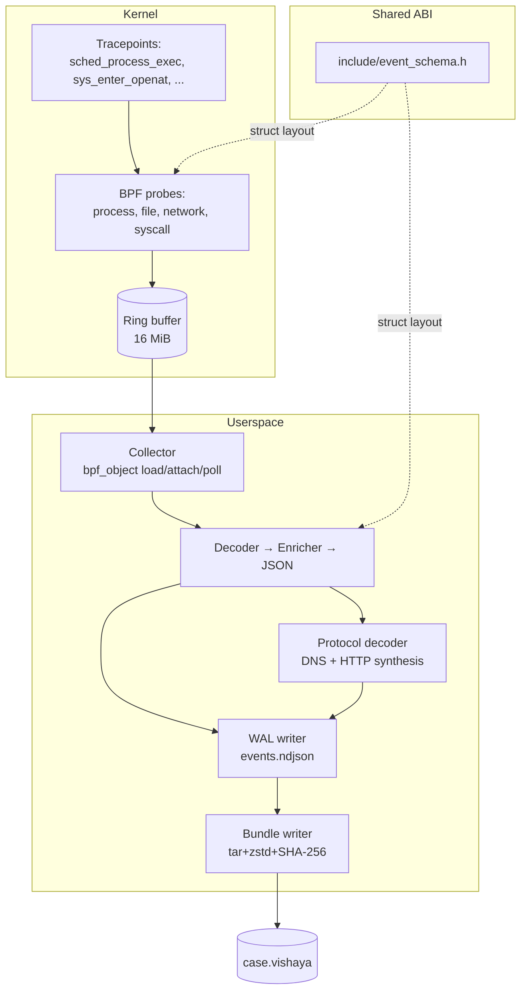
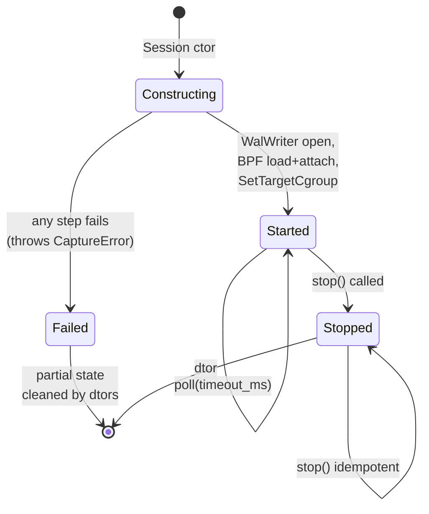

# Vishaya — Architecture (v0.1)

This is the design reference for v0.1. Every decision here has been discussed and locked in. Changes to this document require an explicit decision, not drift.

Companion docs:
- [vision.md](./vision.md) — product scope and principles
- [flow.md](./flow.md) — sequence diagrams for capture and inspect paths
- [code-walkthrough.md](./code-walkthrough.md) — module-by-module tour of the implementation
- [concepts.md](./concepts.md) — background primer (eBPF, cgroups, namespaces, DFIR)
- [bundle-spec-v0.1.md](./bundle-spec-v0.1.md) — bundle format specification
- [build.md](./build.md) — CMake structure and dependency graph

---

## 1. Scope

Vishaya v0.1 is a Linux-only, eBPF-native forensic capture tool that:

1. Launches a target binary inside a scoped isolation boundary (namespaces + cgroup)
2. Captures the target and its descendants via eBPF probes (process, file, network events)
3. Writes everything to a single portable `.vishaya` bundle file
4. Provides a CLI to inspect any `.vishaya` bundle offline

Everything else (artifact extraction, diffing, DNS resolution correlation, HTTPS plaintext, LLM integration, SCAP interop) is deferred and does not shape the v0.1 architecture beyond ensuring the design does not preclude those additions later.

---

## 2. System overview

Three layers plus one shared ABI:



For detailed sequence diagrams of the capture and inspect flows, see [flow.md](./flow.md).

---

## 3. High-level runtime picture

### Capture path

```
User ─── vishaya capture --target ./sample.elf --output case.vishaya ──┐
                                                                        ▼
                                                              ┌───────────────┐
                                                              │ cli/          │
                                                              │ dispatch      │
                                                              └───────┬───────┘
                                                                      ▼
                                             ┌────────────────────────────────────┐
                                             │ capture/                           │
                                             │  1. isolation setup (ns + cgroup)  │
                                             │  2. BPF load + attach              │
                                             │  3. fork+exec target into cgroup   │
                                             │  4. ring buffer poll               │
                                             │  5. decode → enrich → WAL write    │
                                             └───────────────────┬────────────────┘
                                                                 ▼
                                                     /tmp/vishaya-<uuid>/
                                                     ├── events.ndjson
                                                     └── artifacts/   (v0.5+)

                                                      (target exits or Ctrl-C)
                                                                 ▼
                                             ┌────────────────────────────────────┐
                                             │ bundle/writer                      │
                                             │  1. reconstruct process tree       │
                                             │  2. build manifest.json            │
                                             │  3. tar+zst → case.vishaya.tmp     │
                                             │  4. fsync + rename → case.vishaya  │
                                             │  5. teardown isolation, cleanup    │
                                             └───────────────────┬────────────────┘
                                                                 ▼
                                                            case.vishaya
```

### Inspect path

```
User ─── vishaya tree case.vishaya ──┐
                                      ▼
                             ┌───────────────┐
                             │ cli/          │
                             └───────┬───────┘
                                     ▼
                          ┌────────────────────┐
                          │ bundle/reader      │
                          │  1. validate schema│
                          │  2. parse manifest │
                          │  3. stream events  │
                          └──────┬─────────────┘
                                 ▼
                          ┌───────────────┐
                          │ inspect/tree  │  (or files, network, timeline)
                          └───────┬───────┘
                                  ▼
                             stdout view
```

Capture requires root (eBPF + namespaces). Inspect requires no privileges — just read the file.

---

## 4. Module layout

Actual directory structure as of v0.1:

```
bpf/                            (kernel-side probes)
  vishaya.bpf.c                 (aggregator; #includes the four probe files)
  vishaya_common.bpf.h          (maps, helpers, cgroup filter, payload capture)
  vishaya_process.bpf.c
  vishaya_file.bpf.c
  vishaya_network.bpf.c
  vishaya_syscall.bpf.c

include/
  event_schema.h                (shared C ABI between BPF and userspace)

src/
  common/                       (log, errors, TmpDir RAII helper)
  collector/                    (inherited BPF load/attach/poll — namespace vishaya::collector)
  decoder/                      (raw bytes → EventVariant — namespace vishaya::collector)
  enricher/                     (/proc enrichment for process events — namespace vishaya::collector)
  isolation/                    (Cgroup + target_launch)
  bundle/                       (writer + reader + manifest + process_tree + schema_version)
  capture/                      (Session + WalWriter + event_to_json + protocol_decoder)
  inspect/                      (tree/files/network/timeline subcommands)
  cli/                          (dispatcher + capture_cmd + main)

scripts/
  linux.sh                      (build + host check)
```

### Library dependency graph


Solid arrows = PUBLIC link (headers exposed transitively). Dashed = PRIVATE (implementation dep only).

**Cross-module dependency direction is strictly one-way** (top-down in the graph above). No cycles. The rule: `cli/` may depend on anything below it; `capture/` and `inspect/` never depend on each other; both depend on `bundle/`; `bundle/` and `isolation/` are peers; everything depends on `common/`.

### Session state machine

The `vishaya::capture::Session` lifetime dictates when BPF probes are alive:



The critical invariant: `started_ = true` is set *immediately* after `Collector::Start()` succeeds, before any subsequent constructor code that could throw. This guarantees the destructor will properly detach BPF probes even on partial-construction failures.

---

## 4. Bundle format (v0.1)

Single file: `case.vishaya`. Container: `tar.zst`. Contents:

```
case.vishaya  (tar.zst)
├── manifest.json
├── events.ndjson
└── process_tree.json
```

`artifacts/` directory reserved but empty in v0.1.

### manifest.json

```json
{
  "schema_version": "0.1.0",
  "tool": {
    "name": "vishaya",
    "version": "0.1.0"
  },
  "capture": {
    "started_at": "2026-07-19T12:34:56Z",
    "ended_at":   "2026-07-19T12:35:41Z",
    "duration_seconds": 45,
    "host": {
      "kernel": "6.8.0-40-generic",
      "arch": "x86_64",
      "distro": "Ubuntu 24.04"
    }
  },
  "target": {
    "path": "/path/to/sample.elf",
    "sha256": "…",
    "args": ["arg1", "arg2"],
    "envp_count": 42
  },
  "isolation": {
    "namespaces": ["mnt"],
    "cgroup_path": "/sys/fs/cgroup/vishaya-<uuid>"
  },
  "coverage": {
    "domains": ["process", "file", "network"],
    "syscalls_captured": false
  },
  "counts": {
    "events_total": 12456,
    "events_dropped": 0,
    "processes_seen": 7
  },
  "integrity": {
    "events_sha256": "…",
    "process_tree_sha256": "…"
  }
}
```

### events.ndjson

One event per line, JSON-serialized from the existing C event schema (`include/event_schema.h`). Reuses the existing sink's serialization work as much as possible.

### process_tree.json

```json
{
  "root_pid": 12345,
  "processes": [
    {
      "pid": 12345,
      "ppid": 1,
      "comm": "sample.elf",
      "exec_path": "/path/to/sample.elf",
      "start_time_ns": 1234567890,
      "end_time_ns":   1234612890,
      "children": [12346, 12347]
    },
    …
  ]
}
```

### Schema versioning rules

- `manifest.schema_version` follows semver.
- Reader rejects **bundle major > reader major** with a clear error.
- Reader accepts **bundle major ≤ reader major**; ignores fields it doesn't recognize.
- v0.x is explicitly unstable; v1.0.0 will be the first frozen major.

---

## 5. Event family coverage (v0.1)

| Family | Enabled by default | Notes |
|---|---|---|
| **Process** | Yes | exec, fork, exit, clone, clone3, vfork |
| **File** | Yes | openat, unlinkat, renameat2 (existing set) |
| **Network — socket lifecycle** | Yes | socket, connect, accept, bind, listen, close, sendto, recvfrom, sendmsg, recvmsg, read/write on sockets, shutdown (existing) |
| **Network — DNS** | Yes | Parse UDP:53 payload in userspace decoder. Requires small payload capture (first N bytes) on UDP sends/recvs. Emits `dns-query` / `dns-answer` events with question, type, resolved IPs. |
| **Network — HTTP plaintext** | Yes | Parse first N bytes of TCP send/recv looking for HTTP/1.x method line and Host header. Emits `http-request` / `http-response` events with method, path, host, status. |
| **Network — HTTPS plaintext** | **DEFERRED to v0.5+** | Requires TLS-library uprobes (OpenSSL / BoringSSL / GnuTLS / NSS / Go crypto/tls). HTTPS *connections* still captured at socket level (endpoints, byte counts). |
| **Syscall** | No (opt-in via `--enable-syscalls`) | Existing raw sys_enter / sys_exit capture. High volume, low semantic value for default DFIR use. |

---

## 6. Isolation model (v0.1)

Target runs inside a fresh cgroup and a mount namespace:

- **Cgroup v2** — the scoping mechanism. Target is placed in a fresh cgroup at capture start; all eBPF probes filter events by cgroup ID via `bpf_get_current_cgroup_id()` and drop events from any other cgroup. Children inherit the cgroup automatically → correctness is kernel-managed.
- **Mount namespace** — target has an isolated view of the filesystem. `MS_REC | MS_PRIVATE` on `/` prevents mount changes from propagating back to the host.
- **PID namespace** — deliberately NOT used in v0.1. Would require a double-fork trick (unshare + fork so the target becomes PID 1) that adds complexity without buying scoping — cgroup filter already handles that. Deferred to v0.5 if needed for container-like semantics.
- **Network namespace** — deliberately NOT used in v0.1. Isolating the target's network without a veth pair means the target has no network at all (just loopback), which severely limits realistic malware analysis. Full net-ns + veth setup is deferred to v0.5.
- **User namespace** — deliberately NOT used (see D3 below).

The critical scoping invariant is cgroup-based, not namespace-based. Namespaces are for *isolation* (protecting host, controlling what target sees). Scoping (capturing only target activity) is 100% cgroup-driven.

---

## 7. Design decisions (locked)

### D1. Single binary with subcommands
`vishaya capture`, `vishaya tree`, `vishaya files`, `vishaya network`, `vishaya timeline`. Mental model: `git`, `docker`, `kubectl`. One artifact to install, one thing to explain.

### D2. Target scoping via cgroups v2 (not PID tracking)
Target is placed in a fresh cgroup at capture start. All BPF probes filter events by cgroup ID via `bpf_get_current_cgroup_id()`. Children inherit the cgroup automatically → correctness is kernel-managed. Cleaner than maintaining a "watched PID" BPF map.

### D3. Isolation = cgroup + mount namespace only, no PID/net/user namespaces
Cgroup handles scoping (which is the core requirement). Mount namespace gives filesystem isolation cheaply. PID and net namespaces add real code complexity (double-fork for PID, veth setup for net) without contributing to scoping — deferred to v0.5+. User namespace causes real compat issues (uid mapping confuses many binaries and some malware); skipped permanently. We already require root for eBPF anyway.

### D4. Temp WAL to `/tmp/vishaya-<uuid>/`, finalize on target exit
Events stream to a scratch directory during capture. On target exit (or SIGINT), the writer reconstructs the process tree, builds the manifest, tar+zst's the scratch dir into `.vishaya.tmp`, fsyncs, and renames to the final `.vishaya` (atomic write). Scratch dir cleaned up last. Survives long captures (no RAM ceiling) and interrupted captures (scratch dir still readable for salvage).

### D5. Process tree reconstruction in userspace at finalize
The bundle writer walks the event stream once at finalize, building the process tree from fork/exec/exit events. Simpler than maintaining tree state in kernel. Only runs once per capture.

### D6. Bundle schema versioning via manifest semver
`manifest.schema_version` (semver). Reader compat rules: same major → accept, ignore unknown fields; newer major → reject with clear error. This is the primary extension mechanism.

### D7. Build pipeline: CMake → clang (BPF) → bpftool skeleton → C++ userspace
Existing scripts/linux.sh already does this. Minor cleanup only.

### D8. Config: CLI flags primary, YAML file for defaults only
`vishaya capture --target X --output Y [--enable-syscalls] [--no-network]`. Optional `~/.config/vishaya/config.yaml` for per-user defaults (e.g., default output dir). Env vars: not used.

### D9. No daemon, no server, no state between runs
`vishaya capture` runs, exits when target exits, leaves exactly one `.vishaya` file. No pid file, no lock file, no persistent state directory. Fully stateless.

---

## 8. Design patterns (in use)

- **RAII** — every resource with a lifetime (BPF handle, cgroup, tmpdir, tar archive, target process, namespace fds) is owned by a scope-guarded object. No manual cleanup.
- **Pipeline** — capture path is `ring_poller → decoder → enricher → wal_writer`, each a free function or small class taking the previous stage's output. No hidden framework.
- **Command** — each CLI subcommand is a small object with `parse_args(argc, argv)`, `execute()`, `exit_code()`. Dispatcher is a switch on `argv[1]`.
- **Visitor** — bundle reader exposes `for_each_event(callback)`; callback receives typed event references. Keeps bundle internals private, keeps inspect code parser-free.
- **Versioned additive schema** — event schema and bundle manifest both evolve additively. New event types get new tag values; new manifest fields are ignored by old readers. Extension without breakage.

Explicitly avoided: dependency injection containers, plugin loaders, virtual base classes for pipeline stages, factory patterns for events, observer/pubsub for cross-cutting concerns.

---

## 9. Dependencies (complete list)

| Dependency | License | Purpose |
|---|---|---|
| libbpf | BSD-2 | eBPF load/attach/poll |
| bpftool | GPL-2 | BPF object inspection at build |
| clang / LLVM | Apache-2 | Compile BPF programs |
| kernel BTF | GPL-2 | CO-RE |
| CMake | BSD-3 | Build system |
| C++17 stdlib | (compiler) | Base language |
| **libzstd** | BSD-3 | Bundle compression (new) |
| **libarchive** | BSD-2 | Tar container read/write (new) |
| **nlohmann/json** | MIT (header) | manifest + process_tree.json (new) |
| **CLI11** | BSD-3 (header) | Subcommand arg parsing (new) |
| **OpenSSL libcrypto** | Apache-2 | SHA-256 for integrity hashes (new; ubiquitous on Linux) |
| Catch2 or GoogleTest | BSL-1 / BSD-3 | Testing (test-only) |

Total new dependencies: 4 small libraries. All BSD/MIT. All packaged in mainstream Linux distros.

**Not added:** JSON schema validator, plugin loader, DI container, ORM, YAML validator (basic yaml-cpp only if needed), spdlog (std::cerr is enough for v0.1), Boost.

---

## 10. Extension model (future features stay additive)

Extension recipes for later work — none of these are built in v0.1, but the architecture must not preclude them:

- **New event family (e.g., container attach events):** new enum tag in `event_schema.h`, new `.bpf.c` file, optionally new bundle section, optionally new `inspect/` subcommand. Old readers skip unknown event types.
- **New bundle section (e.g., `signatures.yara`, `iocs.json`):** add to manifest section list, add file to bundle. Old readers skip unknown sections.
- **New CLI subcommand (e.g., `vishaya diff`):** one new file in `src/inspect/`, added to dispatcher. No other code changes.
- **New enrichment (e.g., DNS reverse lookup):** added to `capture/enricher.cpp`. Bundle format unchanged.
- **HTTPS plaintext (v0.5+):** new uprobe attachments in `bpf/`, new event subtypes for `tls_read` / `tls_write`. Old bundles unaffected.
- **LLM/MCP integration (deferred entirely):** separate binary or subcommand consuming existing `.vishaya` bundles. Bundle format unchanged.
- **SCAP interop (deferred entirely):** either an optional embedded `.scap` inside the `.vishaya` container, or a separate `vishaya export --format scap` subcommand. Bundle format unchanged.

The three extension mechanisms — additive event types, additive manifest sections, additive CLI subcommands — cover essentially every future feature we've discussed. No plugin API or scripting layer is needed.

---

## 11. Non-goals (architectural)

- No runtime alerting, blocking, or policy enforcement (would require kernel-side decision hooks; explicitly out)
- No fleet monitoring (would require aggregation infrastructure; explicitly out)
- No Windows, Mac, BSD (would require abstracting the isolation layer; explicitly out)
- No cloud dependencies (no telemetry, no update checks, no crash reporting)
- No web UI or dashboard in v1
- No third-party / notarized trust anchor in v0.1. Bundles ARE integrity-hashed
  (SHA-256) and signed by default with a locally auto-generated Ed25519 key, and
  the reader verifies both at load time. This is tamper-evidence, not third-party
  attestation: the public key travels inside the manifest, so it proves internal
  consistency, not identity. Keyless attestation (Sigstore/Rekor) is deferred to
  a later version.

---

## 12. Deferred decisions (revisit at v0.5)

- Bundle event format: **NDJSON in v0.1**. Migration to a binary format (Cap'n Proto, FlatBuffers, or custom) is a v0.5+ decision if NDJSON becomes a bottleneck. Format version bump would handle it.
- Whether to include an embedded `.scap` for Stratoshark/Falco interop (deferred; would be additive to the container).
- Whether to add OCSF export as a subcommand (deferred).
- Whether to add a web UI (deferred; CLI-first is a v1 principle).
- HTTPS plaintext capture strategy — OpenSSL uprobes first, then GnuTLS/BoringSSL/Go/rustls case by case (deferred to v0.5+).

---

## 13. What comes next

1. **Bundle format spec** — a dedicated `docs/bundle-spec-v0.1.md` that pins the exact JSON schemas for `manifest.json` and `process_tree.json`, and the exact tar layout. That doc becomes the authoritative reference for both the writer (in-repo) and any future third-party reader.
2. **Collector rework plan** — a small doc describing the concrete diff from the existing collector (JSON sink → WAL writer + bundle finalize) so the code work is scoped.
3. **Isolation prototype** — the smallest possible standalone C++ program that spawns a target in the intended isolation, without eBPF, to prove the namespaces + cgroup setup works. Standalone because it's the riskiest new piece.

Once those three are in place, v0.1 build proper begins.
