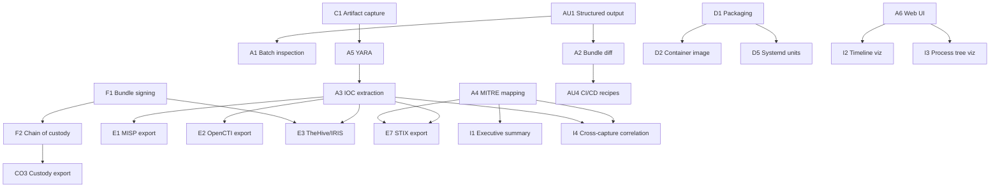

# Enterprise Features — Detailed Plan

Roadmap and design notes for features that move Vishaya from a personal-scope open-source tool to something DFIR teams and IR firms can standardize on. Read after [vision.md](vision.md) and [roadmap.md](roadmap.md) — this document goes deeper on the "how" and "in what order" for the enterprise-facing work.

## 1. Framing: what "enterprise-grade" means here

Vishaya is a **forensic capture tool**, not an EDR, not a SIEM, not a fleet monitor. That's a permanent design decision (see [vision.md](vision.md)). "Enterprise-grade" therefore does *not* mean adding continuous monitoring, alerting, or fleet management — those are different products doing different jobs.

For Vishaya specifically, enterprise-grade means:

- **Deployable in real IR firms and CERT teams without friction** — packaged, documented, works on hardened hosts, respects existing policies.
- **Integrates with the tools those teams already use** — MISP for threat intel, TheHive or DFIR-IRIS for case management, MITRE ATT&CK for classification, YARA for detection.
- **Produces evidence that stands up to scrutiny** — chain of custody, tamper detection, redaction of sensitive fields, court-admissible provenance.
- **Automates analyst workflows** — API for programmatic capture, batch analysis of many bundles, diff across cases, IOC extraction pipelines.
- **Respects analyst time** — better UX than "read raw JSON," search across bundles, collaborative annotations, executive summaries.

Everything in this document should be evaluated against those criteria. If a proposed feature drifts toward EDR territory (alert-shaped output, continuous monitoring, agent-on-every-host), it belongs in a different tool.

## 2. Feature clusters

Organized by the analyst workflow they enable, not by version.

### 2.1 Forensic integrity

The evidence-preservation layer. If Vishaya bundles aren't trustworthy in an adversarial or compliance context, everything above this layer is questionable.

**F1. Bundle signing** *(priority: high · effort: 2-3 weeks)*
- Cryptographically sign `.vishaya` bundles at write time.
- Support ed25519 keys directly, plus optional Cosign / Sigstore integration for keyless signing (OIDC-based, standard in cloud-native workflows).
- Reader verifies signature and prints WHO signed. Verification failure is a loud warning, not a silent trust-anyway.
- Signature covers the entire tar contents; separate signature entry `manifest.sig` in the tar. Optional so bundles remain readable by v0.1-vintage readers.
- **Dependency:** none (self-contained).

**F2. Chain-of-custody log** *(priority: high · effort: 1 week)*
- Every touch of a bundle (capture, verification, extraction, upload) recorded in a companion `custody.log` sidecar with timestamps, user, host, tool version.
- Signed with the bundle if F1 is in play.
- Simple append-only JSON; not a distributed ledger.
- **Dependency:** F1 for signing.

**F3. Bundle encryption** *(priority: medium · effort: 2 weeks)*
- Optional AES-256-GCM encryption of the tar contents with a passphrase or public key.
- Encrypted bundles have `.vishaya.enc` extension; readers decrypt transparently when given the key.
- Threat model: someone gets physical access to a bundle file and shouldn't be able to read its contents. Not for at-rest encryption of a datastore (that's the OS's job).
- **Dependency:** none.

**F4. PII redaction** *(priority: medium · effort: 2 weeks)*
- Configurable redaction of sensitive fields: environment variable *values*, argv containing detected patterns (SSH keys, tokens), paths matching a redaction list.
- Redacted bundle has a manifest flag; readers can display what was redacted without showing the values.
- Critical for GDPR / HIPAA-adjacent captures.
- **Dependency:** none.

**F5. Retention and lifecycle policy** *(priority: low · effort: 1 week)*
- Optional bundle expiry metadata in the manifest.
- Companion `vishaya prune` command to sweep expired bundles from a directory.
- Not a scheduler — that's cron's job.
- **Dependency:** none.

### 2.2 Analyst tooling and UX

The layer above raw CLI. What makes an analyst *want* to use Vishaya over their existing workflow.

**A1. Batch inspection commands** *(priority: high · effort: 1 week)*
- `vishaya batch tree *.vishaya` — process trees for many bundles side by side.
- `vishaya batch network --filter 'remote.port=443' *.vishaya` — filter events across bundles.
- Output as table or JSON for downstream tooling.
- **Dependency:** none.

**A2. Bundle diff** *(priority: high · effort: 2 weeks)*
- `vishaya diff a.vishaya b.vishaya` — structured comparison.
- Shows: processes only in A, files touched by A but not B, endpoints contacted differently.
- Optional `--format ndjson` output for pipelines.
- Enables "run same malware twice, see what differs" workflows.
- **Dependency:** none.

**A3. IOC extraction** *(priority: high · effort: 1 week)*
- `vishaya iocs case.vishaya` — extract hashes, domains, IPs, URLs into standard formats.
- Output STIX 2.1, MISP JSON, and plain-text IOC lists.
- Feeds threat-intel workflows directly.
- **Dependency:** none.

**A4. MITRE ATT&CK mapping** *(priority: medium · effort: 3-4 weeks)*
- Rule-based mapping from captured events to ATT&CK techniques.
- E.g., writes to `/etc/cron.d/*` → T1053.003 (Cron); `exec` of `/tmp/*` → T1204.002 (Malicious File).
- Mappings live in a YAML rules file so analysts can extend without recompiling.
- Emit a `mitre.json` sidecar in the bundle at finalize time.
- `vishaya mitre case.vishaya` prints matched techniques.
- **Dependency:** none. Rule library will grow over time.

**A5. YARA integration** *(priority: medium · effort: 2 weeks)*
- Scan captured artifacts (when v0.5's artifact capture lands) against YARA rulesets.
- Emit matches into `iocs.json` sidecar.
- `vishaya yara --rules rules/ case.vishaya` — post-capture scan.
- `vishaya capture --yara-rules rules/` — inline during capture.
- **Dependency:** artifact capture (see 2.6).

**A6. Web UI (optional companion)** *(priority: low · effort: 6-10 weeks)*
- Separate project, opt-in install.
- Local-only by default (no auth needed). Loads a `.vishaya` bundle and shows process tree, timeline, artifact browser, network graph.
- SvelteKit or plain vanilla JS — no framework churn.
- Deliberately optional; CLI remains primary.
- **Design principle:** the web UI is a *viewer*, not a *service*. No hosted mode, no multi-tenancy, no user accounts. If you need those, deploy behind your own reverse proxy with your own auth.
- **Dependency:** stable bundle format (v1.0).

**A7. Terminal UI (ratatui)** *(priority: low · effort: 3-4 weeks)*
- `vishaya tui case.vishaya` — interactive terminal browser.
- Faster than opening a web browser for many analysts.
- Rust-based via ratatui (would be Vishaya's first Rust dependency; consider carefully).
- **Dependency:** stable bundle format (v1.0). Rust toolchain.

**A8. Analyst notes / annotations** *(priority: medium · effort: 1 week)*
- `vishaya note case.vishaya add "possible persistence via cron"` — attach a note to the bundle.
- Notes stored in a `notes.ndjson` sidecar, timestamped, attributed.
- Analysts add notes as they investigate.
- **Dependency:** none.

### 2.3 Automation and API

The layer that makes Vishaya a component in larger workflows.

**AU1. Structured output for all commands** *(priority: high · effort: 1 week)*
- Every inspect subcommand gains `--format ndjson|json|table` (default table).
- Pipeable output for downstream tools.
- **Dependency:** none.

**AU2. Exit code discipline** *(priority: high · effort: few days)*
- Consistent exit codes across all commands: 0 success, 1 general error, 2 usage error, 3 validation error, 4 integrity failure, etc.
- Documented in build.md.
- **Dependency:** none. Small refactor.

**AU3. Watch mode** *(priority: medium · effort: 2 weeks)*
- `vishaya capture --watch /path/to/binary` — capture repeatedly as the binary is modified (useful for iterating on suspected malware behavior).
- Produces numbered bundles.
- Detects binary changes via inotify.
- **Dependency:** none.

**AU4. CI/CD integration recipes** *(priority: medium · effort: 1 week)*
- Documented patterns for using Vishaya in CI pipelines: capture a build artifact's runtime behavior, diff against a known-good baseline, fail the build on suspicious deviation.
- GitHub Actions workflow example, GitLab CI example, Jenkins declarative example.
- **Dependency:** A2 (diff).

**AU5. Programmatic capture API** *(priority: low · effort: 4-6 weeks)*
- Small HTTP API server (`vishaya serve`) exposing capture and inspect over REST.
- Local-only default; enterprise deployers can put behind auth-proxy.
- OpenAPI spec, generated client stubs.
- **Design principle:** the server is stateless — it captures on demand and returns the bundle. No database, no user management, no case tracking. That's someone else's job.
- **Dependency:** stable bundle format, exit-code discipline.

### 2.4 Ecosystem integration

Vishaya as a first-class citizen in the existing DFIR tool ecosystem.

**E1. MISP export** *(priority: high · effort: 1 week)*
- `vishaya export misp case.vishaya --url https://misp.example --key ...` — push IOCs directly to a MISP instance as an event.
- Attributes: hashes, domains, IPs, YARA rule names.
- **Dependency:** A3 (IOC extraction).

**E2. OpenCTI export** *(priority: high · effort: 1 week)*
- Same pattern as MISP, targeting OpenCTI's Python client.
- **Dependency:** A3.

**E3. TheHive / DFIR-IRIS integration** *(priority: high · effort: 2 weeks)*
- `vishaya export thehive case.vishaya --org ...` — create a case + observables in TheHive.
- Similar for IRIS.
- Bundle itself uploaded as case attachment.
- **Dependency:** A3, F1 (signing so the case ties to a verified bundle).

**E4. Elastic / OpenSearch ingest** *(priority: medium · effort: 2 weeks)*
- Companion tool: `vishaya index --to elastic://... case.vishaya` — send events as documents into an index.
- Enables search across bundles at scale.
- Predefined field mappings (ECS-compatible where possible).
- **Dependency:** A1 (batch), AU1 (structured output).

**E5. Cuckoo3 / CAPE adapter** *(priority: medium · effort: 4-6 weeks)*
- Vishaya as a capture backend for existing sandbox orchestrators.
- Cuckoo/CAPE calls out to `vishaya capture`, ingests the resulting `.vishaya` bundle into its own workflow.
- Written as a Cuckoo module / CAPE processor.
- **Dependency:** stable bundle format (v1.0).

**E6. Sigma rule compatibility** *(priority: low · effort: 3-4 weeks)*
- Read Sigma detection rules and match against captured events.
- Not all Sigma rules apply (many are log-source specific), but the process/file/network subset is high-value.
- `vishaya sigma --rules sigma-rules/ case.vishaya`.
- **Dependency:** A2 patterns for event querying.

**E7. STIX 2.1 bundle export** *(priority: low · effort: 2 weeks)*
- Full STIX 2.1 export of a Vishaya bundle: observables, indicators, malware SDO, relationships.
- Enables sharing via TAXII servers.
- **Dependency:** A3, A4 (MITRE mapping).

### 2.5 Intelligence layer

Turning raw events into insights.

**I1. Executive summary generator** *(priority: medium · effort: 3-4 weeks)*
- `vishaya summary case.vishaya` — one-screen text summary suitable for pasting into a ticket or slide.
- Covers: what did the target do, what did it touch, what endpoints contacted, notable behaviors (persistence attempts, network exfil patterns, etc.).
- Rule-based, deterministic. No LLM required.
- **Dependency:** A4 (MITRE).

**I2. Timeline visualization** *(priority: medium · effort: 3-4 weeks, or free with A6 web UI)*
- Graphical timeline of events, grouped by family, with density heatmap.
- SVG output for reports, or interactive in the web UI.
- **Dependency:** A6 (web UI) or standalone.

**I3. Process tree visualization** *(priority: medium · effort: 2 weeks, or free with A6 web UI)*
- SVG process tree suitable for embedding in incident reports.
- ASCII already available via `vishaya tree`; this is the "for the CISO" version.
- **Dependency:** A6 (web UI) or standalone Graphviz output.

**I4. Cross-capture correlation** *(priority: low · effort: 4-6 weeks)*
- Given N bundles, find shared: infrastructure (endpoints), tools (binaries), TTPs (MITRE techniques).
- Useful for tracking malware families across samples.
- `vishaya correlate *.vishaya` outputs a report identifying overlap clusters.
- **Dependency:** A3, A4.

**I5. LLM-powered analyst assistant** *(priority: low; explicitly optional · effort: 6-8 weeks)*
- MCP (Model Context Protocol) server exposing `.vishaya` bundles as tools/resources.
- Analysts drop a bundle into Claude Desktop, ChatGPT, or a local Ollama model and chat with it.
- Tools: `list_processes`, `get_files_written(pid)`, `get_network_flows`, `extract_ioc`.
- **Design principle:** the LLM is an *analyst assistant*, not an authoritative analyzer. All AI output is marked as suggestions requiring human verification.
- **Not a core dependency** — Vishaya works fully without it. This exists for analysts who want it, doesn't burden analysts who don't.
- **Dependency:** stable bundle format (v1.0).

### 2.6 Coverage expansion (BPF-side)

Extending what Vishaya can capture, not how it packages it.

**C1. Artifact capture (dropped files)** *(priority: high · effort: 4-6 weeks)*
- When target writes a file, copy the file content to `artifacts/` in the bundle.
- Bounded per-file size (configurable, default 10 MB) and total capture size (default 100 MB).
- Each artifact has metadata: origin PID, event ID that created it, SHA-256, size.
- **Dependency:** none in v0.5 already-planned scope.

**C2. HTTPS plaintext via TLS uprobes** *(priority: high · effort: 3-5 weeks)*
- Uprobes into OpenSSL and BoringSSL's `SSL_read` / `SSL_write`.
- Version-fragile per library; ship with symbol resolution for common versions.
- Emit `tls-read` / `tls-write` events with plaintext content.
- Deferred deliberately in v0.1 due to complexity and library maintenance burden.
- **Dependency:** none.

**C3. Extended file syscall coverage** *(priority: medium · effort: 2 weeks)*
- Add probes for: `openat2`, `unlink`, `rename`, `symlink*`, `chmod*`, `chown*`, `mknod*`, `truncate*`, `mmap` (writable/executable).
- Rounds out the file-family coverage significantly.
- **Dependency:** none.

**C4. Container context enrichment** *(priority: medium · effort: 2 weeks)*
- When the target is running inside a container (Docker, K8s, systemd-nspawn), enrich events with container ID and namespace info.
- Detected via `/proc/<pid>/cgroup` on the userspace side.
- Adds `container_id` field to the event envelope.
- **Dependency:** none.

**C5. Kernel module load/unload events** *(priority: low · effort: 2 weeks)*
- LSM hook or tracepoint on module init/exit.
- Rare but critical for rootkit detection.
- **Dependency:** LSM BPF support in kernel (5.7+).

**C6. Memory-mapping events (mmap/mprotect)** *(priority: low · effort: 2 weeks)*
- Track RWX transitions that indicate JIT / self-modifying code.
- High signal for advanced malware analysis.
- **Dependency:** none.

**C7. `sendmsg`/`recvmsg`/`sendmmsg`/`recvmmsg` payload capture** *(priority: medium · effort: 2 weeks)*
- Extend Step 9's payload capture to iovec-based syscalls.
- Requires walking msghdr.iov in BPF.
- Closes the DNS/HTTP coverage gap.
- **Dependency:** none.

### 2.7 Deployment and operations

The mundane but critical work that makes Vishaya usable in production IR environments.

**D1. Distribution packaging** *(priority: high · effort: 2 weeks)*
- Debian `.deb`, RPM `.rpm`, and a self-contained tarball.
- Signed releases via GitHub Actions.
- Installs to `/usr/bin/vishaya`, BPF object to `/usr/lib/vishaya/`, config to `/etc/vishaya/`.
- **Dependency:** v1.0.

**D2. Container image** *(priority: medium · effort: 1 week)*
- Official OCI image for CI/CD use (inspect only; capture inside container is complex due to privileges).
- Multi-arch (amd64, arm64).
- Published to GHCR / Docker Hub.
- **Dependency:** D1.

**D3. Structured logging** *(priority: high · effort: 1 week)*
- Convert stderr log lines to structured JSON (opt-in via `--log-format json`).
- Enables log aggregation in enterprise environments (Splunk, ELK, Loki).
- **Dependency:** none. Small refactor.

**D4. Configuration file support** *(priority: medium · effort: 1 week)*
- `/etc/vishaya/vishaya.yaml` for enterprise-wide defaults.
- Per-user `~/.config/vishaya/vishaya.yaml` for overrides.
- CLI flags still trump both.
- **Dependency:** none.

**D5. Systemd unit for scheduled captures** *(priority: low · effort: few days)*
- Example systemd unit + timer for periodic captures of a specific target.
- Not a daemon; each capture is a one-shot invocation.
- **Dependency:** D1.

**D6. Prometheus metrics** *(priority: low · effort: 1 week)*
- If run via `vishaya serve` (AU5), expose `/metrics` with capture counts, sizes, durations, error counts.
- **Dependency:** AU5.

### 2.8 Compliance and audit

Features that let Vishaya be adopted in regulated environments.

**CO1. Audit log** *(priority: high · effort: 1 week)*
- Every Vishaya invocation logged to `/var/log/vishaya/audit.log`: user, timestamp, command, target, output path, exit code.
- Append-only, systemd-journal integration.
- **Dependency:** none.

**CO2. GDPR-mode capture** *(priority: medium · effort: 1 week)*
- `--gdpr` flag automatically enables PII redaction (F4) with a strict rule set.
- Manifest flag documents that GDPR mode was used.
- Not a substitute for legal review; a helper.
- **Dependency:** F4.

**CO3. Chain-of-custody export** *(priority: medium · effort: few days)*
- `vishaya custody case.vishaya` — prints the full chain-of-custody record in a format suitable for evidence submission.
- **Dependency:** F2.

**CO4. Reproducibility bundle** *(priority: low · effort: 2-3 weeks)*
- Optional `.vishaya-repro` sidecar that captures enough environment info to reproduce the capture: kernel version, BPF verifier version, tool version, exact command, target SHA-256.
- Enables "run this capture again on my machine, get comparable results."
- **Dependency:** none.

## 3. Suggested build order

Priority ordering based on: what enterprises need first, what unblocks other features, what's realistically shippable.

### Wave 1 (foundational for enterprise credibility) — 6-8 weeks

Do these before promoting Vishaya to enterprise buyers:

- **F1. Bundle signing** — non-negotiable for chain of custody
- **F2. Chain-of-custody log** — enables CO3
- **AU1. Structured output** — enables E4, E5, all integrations
- **AU2. Exit codes** — small but critical for scripting
- **D3. Structured logging** — enterprise log aggregation
- **CO1. Audit log** — compliance table stakes

### Wave 2 (analyst-facing quick wins) — 6-8 weeks

Ship these to make Vishaya visibly better to use than raw JSON:

- **A2. Bundle diff** — a killer feature nobody in the space has
- **A3. IOC extraction** — trivially useful
- **A1. Batch inspection** — enables A2 and E4
- **A8. Notes / annotations** — small feature, big analyst impact
- **C1. Artifact capture** — closes an obvious gap

### Wave 3 (ecosystem integration) — 8-10 weeks

Turn Vishaya into a first-class DFIR ecosystem citizen:

- **E1. MISP export**
- **E2. OpenCTI export**
- **E3. TheHive / IRIS integration**
- **E4. Elastic ingest**
- **A4. MITRE ATT&CK mapping** — foundation for E3 and I1

### Wave 4 (intelligence layer) — 8-12 weeks

Now that we have coverage and integrations, add the smarts:

- **A5. YARA integration**
- **I1. Executive summary**
- **I4. Cross-capture correlation**
- **C2. HTTPS plaintext**

### Wave 5 (deployment maturity) — 4-6 weeks

Make it professional to install and operate:

- **D1. Packaging**
- **D2. Container image**
- **D4. Config file**
- **CO2. GDPR mode**

### Wave 6 (nice-to-have UX) — 12-16 weeks

Only after everything above is solid:

- **A6. Web UI**
- **A7. Terminal UI** — pick one, not both
- **I2, I3. Visualizations**
- **I5. LLM assistant**
- **AU5. HTTP API server**

## 4. Dependency graph

Features that unlock each other. Build upward.

## 5. Where to compromise vs. where to hold firm

Every product decision is a trade-off. For the enterprise push specifically:

**Hold firm on:**
- **Open source primary.** Every feature above should be Apache-2.0 or similar. Commercial extensions are OK as separate products (see §6), but the core is open forever.
- **CLI-first.** Web UI is optional companion, not primary interface. Analysts on production incident calls use terminals over ssh, not browsers.
- **No mandatory network calls.** Vishaya must work fully air-gapped. Every integration is opt-in.
- **No SaaS.** No "call home" behavior, no crash reporting, no telemetry, no update checks. Enterprises can't tolerate outbound traffic they didn't sanction.
- **No fleet monitoring.** If someone asks for "Vishaya on every host, streaming to central server," politely redirect to Falco or a commercial EDR. That's not what this is.
- **Signed releases only.** Distributed binaries must be signed with a real key.

**Willing to compromise on:**
- **Language monoculture.** Web UI can be TypeScript/Svelte even if the core is C++. Terminal UI can be Rust. Each optional companion can use its best tool as long as the core stays C++.
- **Feature completeness at v1.0.** Ship a solid subset of enterprise features rather than a bloated set. Wave 1+2 alone would put Vishaya ahead of most tools in this niche.
- **Perfect enterprise integrations.** Cover MISP + OpenCTI + TheHive + Elastic — the widely-deployed ones. Skip niche or vendor-specific ones unless someone contributes them.

## 6. Business model options

If someone (probably you, if you're serious about this) wants to make Vishaya sustainable long-term. Written as options, not recommendations.

**Option A: pure open source, no commercial layer.**
- Sustainable via GitHub Sponsors, individual donations, one-off consulting.
- Low overhead, no legal complexity.
- Ceiling: a lot of work for one person unless a foundation adopts it.

**Option B: open core + commercial support.**
- Core (everything in `docs/`) stays open forever.
- Sell paid support contracts to enterprises that need SLAs, priority bug fixes, integration help.
- No feature gating — the same product for paid and non-paid users.
- Precedent: works well for tools with narrow enterprise audiences (e.g., Zeek's model via Corelight; Sysdig OSS + Sysdig Secure).

**Option C: open core + commercial extensions.**
- Core stays open.
- Sell a separate proprietary product for the things enterprises need most: web UI with multi-tenant support, hosted analysis, managed detection rules, threat intel feeds.
- Trade-off: risks the open-source community feeling "screwed" if too much value is behind the paywall. Manage carefully.
- Precedent: how many CNCF-adjacent security companies work (Aqua, Sysdig, Isovalent).

**Option D: dual-license.**
- Core is AGPL for community use; commercial license available for those who need to ship Vishaya inside proprietary products.
- Works well for library-style tools; less well for CLI tools like Vishaya.
- **Not recommended here.**

**Option E: foundation / trust ownership.**
- Donate Vishaya to CNCF, Wireshark Foundation, or Apache.
- Trades control for sustainability + credibility.
- Consider only after significant adoption; foundations don't take on projects that haven't proven traction.

For a personal-scope project moving toward enterprise, **B or C** are the realistic paths. Start with B (support contracts) once there are ~5 enterprise adopters; consider C only if there's genuine differentiation the community won't build.

## 7. Explicit non-goals for enterprise

Even at "enterprise level," these remain permanent non-goals:

- **Continuous fleet monitoring.** Not Vishaya's job. Use Falco or a commercial EDR.
- **Real-time alerting.** Vishaya produces forensic evidence for later analysis. If you need alerts, put an alerting tool downstream.
- **Threat prevention / blocking.** Vishaya observes; it does not enforce. Runtime enforcement is Tetragon's or the LSM subsystem's job.
- **Windows / macOS coverage.** Linux-only, forever. Different OSes need different tools.
- **Custom kernel modules.** eBPF only. Vishaya will never require loading an OOT kernel module.
- **Hosted SaaS.** No cloud service, ever. If someone wants hosted Vishaya, they can deploy it themselves.
- **Vendor lock-in in the bundle format.** `.vishaya` is an open format at v1.0. Third-party writers and readers are welcome. Vishaya's own tooling should never be the only way to consume a bundle.

## 8. First-90-days plan

Concrete. If you started tomorrow, this is what the first 90 days would look like to move Vishaya toward enterprise viability.

**Days 1-30: forensic-integrity floor**
- F1 (signing), F2 (custody log), AU1 (structured output), AU2 (exit codes), D3 (structured logging), CO1 (audit log)
- Documented and tested
- Public announcement: "v0.2 — enterprise-integrity release"

**Days 31-60: analyst-facing wins**
- A2 (diff), A3 (IOC extraction), A1 (batch), C1 (artifact capture)
- Documentation updates for the enterprise features
- 3-5 target IR firms invited to try it

**Days 61-90: first integrations**
- E1 (MISP), E3 (TheHive), A4 (MITRE mapping)
- Real-world use in at least one incident with an early adopter
- Public case study (with adopter's permission) demonstrating end-to-end value

By day 90, Vishaya is either finding real users or clearly not going to. Either outcome informs the next 90 days.

## Where next

- [roadmap.md](roadmap.md) — the version-based public roadmap (this document informs it)
- [vision.md](vision.md) — reminder of what we're not becoming
- [architecture.md](architecture.md) — where these features would fit in the current design
- [bundle-spec-v0.1.md](bundle-spec-v0.1.md) — the format that needs to be v1.0-stable before most enterprise features land
