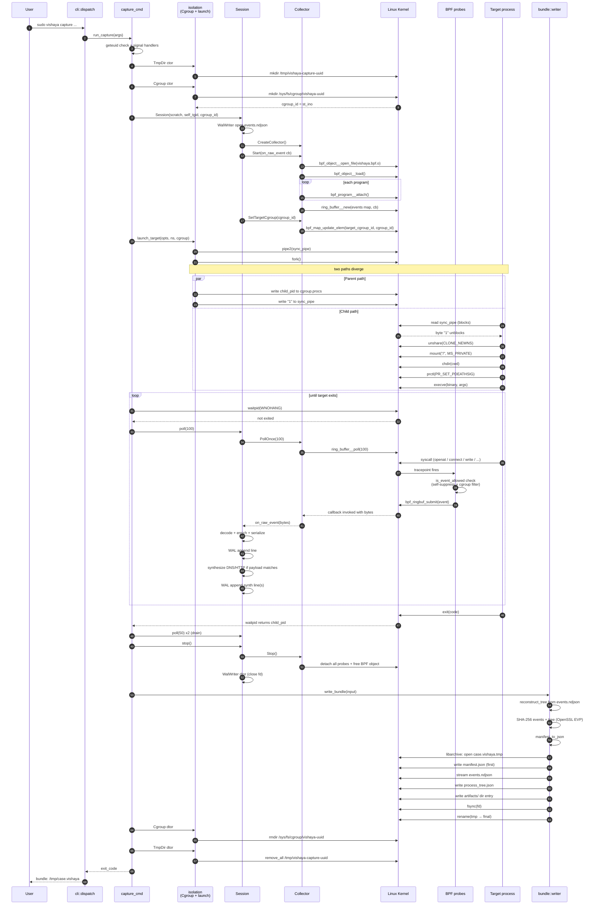
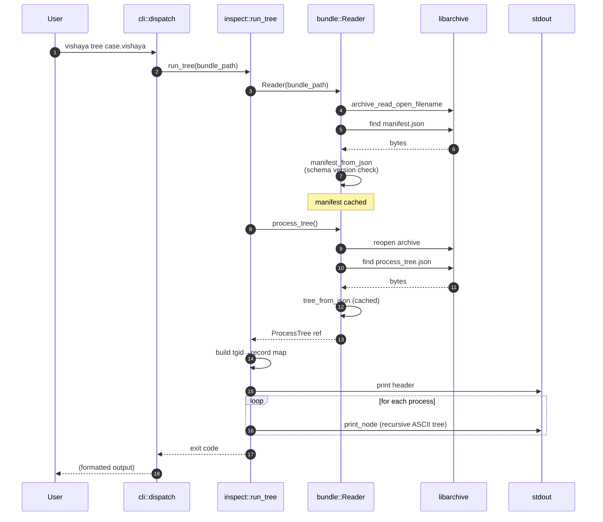
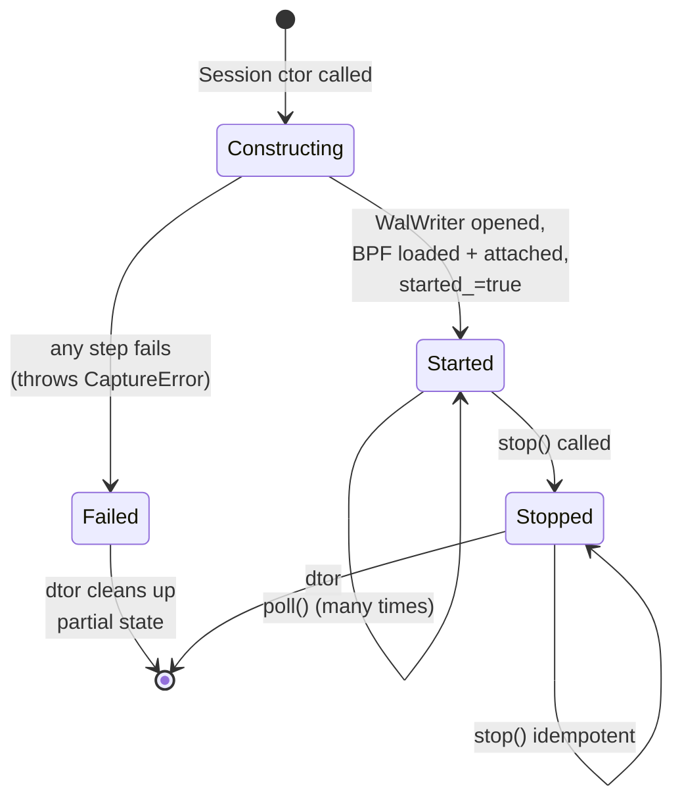
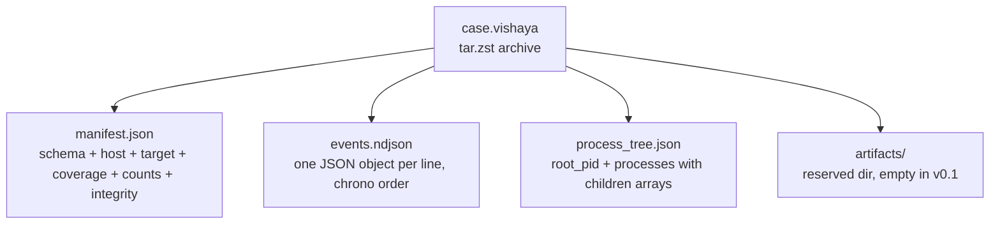

# End-to-End Flow

How Vishaya works from `sudo vishaya capture ...` to `vishaya tree case.vishaya`, with sequence and state diagrams. Diagrams use Mermaid syntax — they render natively on GitHub, GitLab, and modern markdown viewers (VS Code with the Mermaid extension, Obsidian, etc.).

If you haven't read [concepts.md](concepts.md) yet, do that first — this document assumes you know what a cgroup and an eBPF probe are.

## 1. Capture flow — the big picture

Ten steps, from user typing the command to bundle sitting on disk:

```mermaid
flowchart TD
    U([User: sudo vishaya capture --target X -o Y.vishaya])
    U --> D[cli/dispatcher.cpp: route to capture_cmd]
    D --> S[capture_cmd: root check + signal handlers]
    S --> R1[Create TmpDir<br/>&#47;tmp&#47;vishaya-capture-uuid&#47;]
    R1 --> R2[Create Cgroup<br/>&#47;sys&#47;fs&#47;cgroup&#47;vishaya-uuid&#47;]
    R2 --> SESS[Session ctor:<br/>1. Open WAL events.ndjson<br/>2. Load BPF object<br/>3. Attach all probes<br/>4. SetTargetCgroup]
    SESS --> LAUNCH[launch_target:<br/>fork + cgroup attach + unshare + exec]
    LAUNCH --> LOOP[Poll loop:<br/>waitpid WNOHANG + session.poll 100ms<br/>events flow: BPF → ringbuf → WAL]
    LOOP --> DRAIN[Target exits: 2x drain polls,<br/>session.stop, detach BPF]
    DRAIN --> BUNDLE[bundle::write_bundle:<br/>reconstruct tree, hash, tar+zst, atomic rename]
    BUNDLE --> CLEAN[Cgroup + TmpDir destructors]
    CLEAN --> OUT([case.vishaya on disk])
```



## 2. Capture — full sequence diagram

Every actor and every cross-boundary call for a single capture. If a step confuses you, jump to §3 for prose walk-through.



## 3. Capture flow in prose

**Setup (steps 1-13):**

The user invokes `sudo vishaya capture --target /usr/bin/curl -o case.vishaya -- https://example.com`. `main.cpp` calls `cli::dispatch()`. The dispatcher parses the subcommand and calls `capture_cmd::run_capture()`. The capture command checks it's running as root (eBPF needs it), installs SIGINT/SIGTERM handlers that flip an atomic flag, then creates two RAII objects: a `TmpDir` under `/tmp/vishaya-capture-<uuid>/` (scratch dir for the WAL) and a `Cgroup` under `/sys/fs/cgroup/vishaya-<uuid>/`. The kernel gives the cgroup an inode number that becomes our cgroup ID.

**Session construction (steps 14-22):**

Constructing a `Session` is a big deal — it does four things atomically:

1. Opens the WAL file (`events.ndjson` in the scratch dir).
2. Loads the compiled BPF object via `libbpf` (`bpf_object__open_file` + `bpf_object__load`) — this pushes the eBPF bytecode into the kernel, where the verifier checks it and JIT-compiles it.
3. Iterates every program in the object and attaches it to its tracepoint (`bpf_program__attach`).
4. Immediately calls `SetTargetCgroup(cgroup_id)`, which writes our cgroup ID into the `target_cgroup_id` BPF map. Now the `is_in_target_cgroup()` helper in every probe will filter events to just our target.

If any of these fail, the Session throws `CaptureError` and the caller unwinds cleanly (Cgroup and TmpDir dtors run).

Why the strict ordering: the moment probes are attached, they start firing. If we didn't set the cgroup filter *immediately* after attach, we'd catch events from other host processes in the tiny window before target launch.

**Target launch (steps 23-30):**

`launch_target()` implements the classic fork/exec dance with an extra step for cgroup attachment. It:

1. Creates a synchronization pipe.
2. `fork()`s.
3. **In the parent:** writes the child's PID to `<cgroup>/cgroup.procs` (now the child is in our scoped cgroup), then writes a "1" byte to the sync pipe.
4. **In the child:** reads from the sync pipe (blocks until parent's write). Then unshares the mount namespace (`CLONE_NEWNS`), remounts `/` as `MS_PRIVATE` so future mounts don't leak to the host, chdirs to the target's requested working directory, sets `PR_SET_PDEATHSIG` so the child dies if we do, and finally `execve`s the target binary.

The sync pipe is what makes cgroup attachment safe: the child does nothing observable until the parent has attached it to the cgroup.

**Poll loop (steps 31-42):**

Now the target is running under our probes. The capture command spins a loop:

```cpp
while (running) {
    r = waitpid(target_pid, &status, WNOHANG);
    if (r == target_pid) break;      // target exited
    if (r < 0 && errno != EINTR) break;
    session.poll(100);                // drain ring buffer for 100ms
}
```

`session.poll(100)` delegates to `Collector::PollOnce(100)`, which calls `libbpf`'s `ring_buffer__poll(100)`. That blocks up to 100ms, invoking our callback (set up during `Session::Session`) for each event surfaced.

The callback (`Session::on_raw_event`) does:

1. `decoder_.Decode(raw)` — validates and typed-casts into an `EventVariant`.
2. `enricher_.Enrich(event)` — for process events, reads /proc data to fill in fields BPF couldn't.
3. `event_to_json(event)` — serializes to a single JSON line.
4. `wal_->write_line(line)` — appends to `events.ndjson` in the scratch dir.
5. `synthesize_protocol_events(event)` — if the event is a network event with captured payload matching DNS or HTTP shape, produces additional synthetic events. Each also appended to the WAL.

Meanwhile in the kernel: every time the target invokes an interesting syscall, the tracepoint fires, our BPF probe runs, `is_event_allowed()` gates on self-suppression + cgroup filter, then the probe reserves ring buffer space, populates the event, and submits.

**Exit and drain (steps 43-47):**

When the target exits, `waitpid` returns the target PID and we break the loop. We do two more `poll(50)` calls to drain any events queued right at target exit (the `sched_process_exit` tracepoint fires after `execve` returns, and we want to catch it).

`session.stop()` calls `Collector::Stop()` which detaches every probe from its tracepoint and frees the BPF object. The kernel unloads the JIT-compiled code. WalWriter destructor closes the file descriptor.

**Bundle finalization (steps 48-57):**

`bundle::write_bundle(input)` does the finalize:

1. `reconstruct_tree(events_path, root_pid)` — walks events.ndjson line by line, watches for process events, builds the parent→children graph rooted at the target.
2. Computes SHA-256 of `events.ndjson` and `process_tree.json` using OpenSSL EVP.
3. Fills in the manifest with schema/tool version, capture timing, host info, target info (path + SHA-256 + size + args + envp count), isolation info, coverage info, event counts, integrity hashes.
4. `manifest_to_json` produces pretty-printed JSON.
5. Uses libarchive to build a tar archive with zstd compression: writes `manifest.json` first (per spec §2 so streaming readers can validate version before decompressing the rest), then `events.ndjson` streamed from disk, then `process_tree.json`, then an empty `artifacts/` directory.
6. `fsync`s the file to disk, then atomically `rename`s from `<path>.tmp` to `<path>`.

**Cleanup (steps 58-61):**

The stack unwinds. `Cgroup` destructor `rmdir`s the cgroup (empty since target exited). `TmpDir` destructor `remove_all`s the scratch dir. Both log warnings on failure but don't throw. Control returns to the CLI which prints the final `bundle: <path>` message.

## 4. Inspect flow

Much simpler — read a bundle, print a view.



For `vishaya files`, `network`, `timeline`, the pattern is nearly identical but instead of `process_tree()` we call `for_each_event(cb)` — the callback receives each event JSON, we filter by family and print a row.

## 5. Session state machine

The Session's lifetime has three states. Understanding this helps debug capture failures.



The `started_ = true` transition happens *immediately* after `Collector::Start()` succeeds. This is deliberate: if any subsequent line in the ctor throws (e.g., a log call), the destructor will call `stop()`, which will properly detach the BPF probes. Without that ordering, BPF handles would leak.

## 6. Data flow: from syscall to bundle

The pipeline events travel from kernel to disk:

```mermaid
flowchart LR
    subgraph Kernel
        SC[Target syscall] --> TP[Tracepoint fires]
        TP --> PRB[BPF probe:<br/>is_event_allowed]
        PRB -->|allowed| RSV[bpf_ringbuf_reserve]
        RSV --> POP[Populate event fields]
        POP --> SUB[bpf_ringbuf_submit]
        SUB --> RB[(Ring buffer<br/>16 MiB)]
    end

    subgraph Userspace
        RB --> POLL[ring_buffer__poll<br/>via Collector]
        POLL --> CB[Session::on_raw_event]
        CB --> DEC[Decoder validates<br/>and casts to EventVariant]
        DEC --> ENR[Enricher fills<br/>process fields from /proc]
        ENR --> JS[event_to_json:<br/>EventVariant → JSON line]
        JS --> WAL[WalWriter append<br/>to events.ndjson]

        JS --> SYN[protocol_decoder:<br/>DNS + HTTP synthesis]
        SYN -->|synth lines| WAL
    end

    subgraph Finalize
        WAL --> WBW[bundle::writer]
        WBW --> HASH[SHA-256 hashing]
        WBW --> TREE[reconstruct_tree]
        HASH --> MNF[build manifest.json]
        TREE --> MNF
        MNF --> TAR[libarchive tar+zstd]
        TAR --> RN[fsync + rename]
        RN --> V[(case.vishaya)]
    end
```



Roughly a hundred events per second under light load; can climb to tens of thousands per second on a busy target. The 16 MiB ring buffer holds ~5-10 seconds of headroom at high rates — enough that a userspace hiccup won't lose events unless the poll thread is starved.

## 7. Bundle structure

What's actually inside `case.vishaya`:



Order matters at the tar level: `manifest.json` is always the first entry, so a streaming reader can decode the version header and reject a v2 bundle before decompressing gigabytes of events. Everything else can be in any order (spec §2 only requires manifest-first).

## Where next

- [architecture.md](architecture.md) — the design decisions behind why the flow looks like this
- [code-walkthrough.md](code-walkthrough.md) — module-by-module tour of the code implementing these flows
- [event-reference.md](event-reference.md) — what each event in the WAL looks like in detail
- [troubleshooting.md](troubleshooting.md) — when the flow doesn't work
